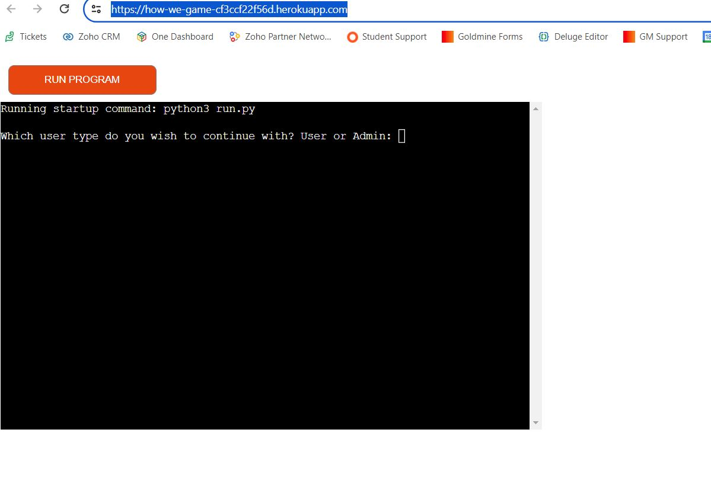
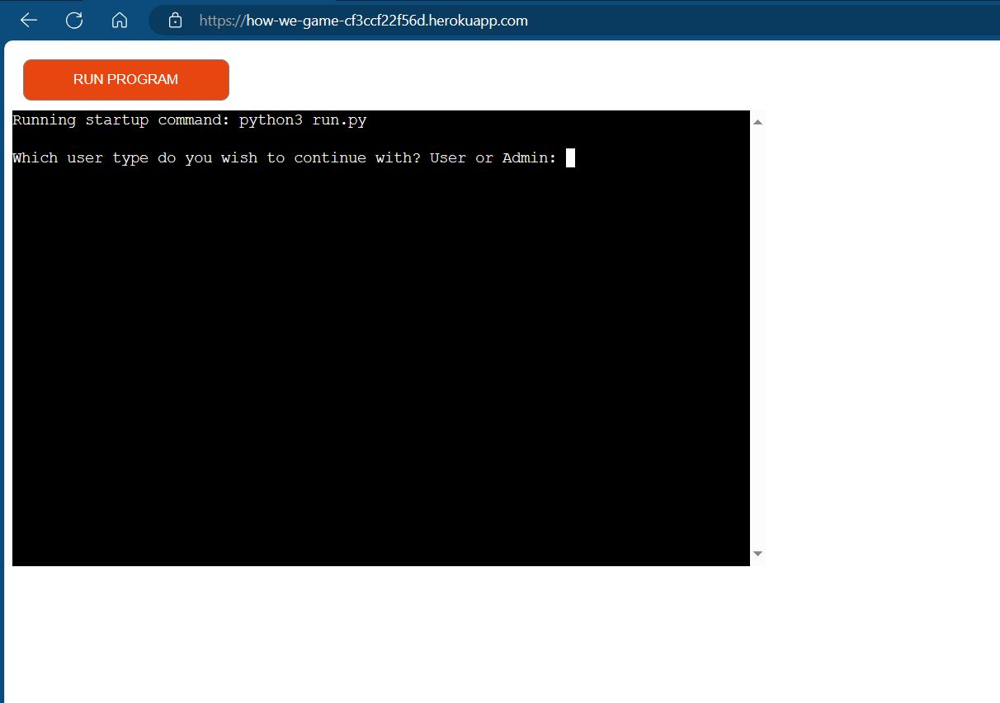

# Welcome to How We Game

- This Python script is designed to conduct a gaming survey and manage the administrative tasks associated with the collected data. Users can participate in the survey by providing their gaming preferences, and administrators can perform various actions such as counting users for each console, analyzing satisfaction ratings, and assessing user loyalty.

### User Survey and Data Collection Module
- Whats is this? 
    - This is a Survey setup around gamers.
- What is the aim of this software    
    - To find out what console people are currently playing.
    - To find out what is the most popular console based on age groups
    - Find out how loyal players are to their console of choice.

## User Hopes

- As a user I hope the software is easy to understand
- As a user I want to limit the amount errors unhandled
- As a user I would want constant information to ensure I am filling the survey out correctly.

## Features

- **User Survey** : Users can participate in the survey by answering questions about their preferred gaming console brand, satisfaction rating, age group, and loyalty choice.
- **Admin Panel** : Administrators have access to an admin panel where they can perform various actions based on user input. Actions include counting users for each console, analyzing satisfaction ratings, and assessing user loyalty.

## Prerequisites

- Google Sheets API Credentials
- Python 3
- Required Python libraries (install using pip install -r requirements.txt):
    - gspread
    - google-auth

## Python Script Overview/Pseudo Code

The provided code is a Python script that implements a simple survey system related to gaming preferences and console usage. The script utilizes Google Sheets for data storage and interaction. Here's a summary of the main components and functionalities:

### Google Sheets Integration

- The script uses the `gspread` library to interact with Google Sheets.
- Google Sheets API credentials are set up using a service account file (`creds.json`).
- The script opens a specific Google Sheets document named 'how_we_game' to store survey responses.

### Constants

- The script defines some constants such as the administrator password (`ADMIN_PASSWORD`) and valid console choices (`VALID_CONSOLE_CHOICES`).

### Mapping Dictionaries

- Dictionaries (`LET_TO_CONSOLE`, `LET_TO_AGE`, `LET_TO_LOYALTY`) are used to map user choices (e.g., 'A', 'B') to corresponding labels (e.g., 'Xbox', '25-34', 'Likely').

### Question Prompts

- A dictionary named `QUESTION_PROMPTS` stores prompts for various survey questions. Each key in the dictionary corresponds to a question, and the associated value is the prompt.

### User Input Validation

- Functions like `handle_invalid_choice` and `validate_satisfaction_rating` handle the validation of user inputs.

### User Survey Functions

- The `user_questions` function collects survey responses from users, validates inputs, and updates the Google Sheets document accordingly.

### Admin Panel Functions

- The `admin_questions` function provides an admin panel to perform various actions based on user input, such as counting users for each console, getting the count of users with ratings above/below a threshold, and counting users likely to stay with their current console brand.

### Export to CSV

- The script includes a function (`export_results_to_csv`) to export survey results to a CSV file.

### Main Function

- The main function serves as the entry point of the script, calling the `user_login` function to prompt users to choose between a regular user and an admin.

### Conditional Execution

- The script includes an `if __name__ == "__main__":` block to ensure that the main function is executed when the script is run.

## Usage

- **Google Sheets Setup:**
    - Create a Google Sheet named 'how_we_game.'
    - Share the sheet with the email address specified in    your Google Sheets API credentials.
- **Credentials:**
    - Obtain the creds.json file containing your Google Sheets API credentials.
    - Install Dependencies:
- **Survey Participation:**
    - Users can participate in the survey by selecting their preferences.
- **Admin Panel:**
    - Administrators can access the admin panel by providing the correct password.
    - Admins can choose from various actions to analyze survey data.
- **Error Handling:**
    - The script handles errors gracefully, providing informative messages to guide users and admins.
- **Data Persistence:**
    - User survey responses are appended to the Google Sheet for ongoing data analysis.

### Survey Questions:
- `console_brand`: Preferred gaming console brand (Xbox, PlayStation, Nintendo, PC).
- `satisfaction_rating`: Satisfaction rating on a scale of 1 to 10.
- `age_group`: Age group (18-24, 25-34, 35-44, 45+).
- `loyalty_choice`: Likelihood to stick with the current gaming console brand (Likely, Neutral, Unlikely).

## Survey Script Functions Overview

This section provides an overview of the functions used in the provided Python script for the How We Game survey system.

### 1. Google Sheets Integration

#### `update_worksheet(data, worksheet_name)`
- **Description:** Updates the specified Google Sheets worksheet with user responses.
- **Parameters:**
  - `data`: List containing user survey data.
  - `worksheet_name`: Name of the Google Sheets worksheet to update.

### 2. User Input and Validation

#### `handle_invalid_choice()`
- **Description:** Handles invalid choices entered by the user.

#### `validate_satisfaction_rating(answer)`
- **Description:** Validates user input for satisfaction rating.
- **Parameters:**
  - `answer`: User input for satisfaction rating.

#### `get_user_choice(prompt, valid_choices)`
- **Description:** Gets and validates user input based on a prompt and valid choices.
- **Parameters:**
  - `prompt`: Prompt for the user.
  - `valid_choices`: Set of valid choices.

### 3. User Survey Functions

#### `user_questions()`
- **Description:** Welcomes the user with a print and displays the user questions then returns the result

#### `get_console_brand()`
- **Description:** Collects user survey responses for the console brand question.

#### `get_satisfaction_rating()`
- **Description:** Collects user survey responses for the Satisfaction rating question.

#### `get_age_group()`
- **Description:** Collects user survey responses for the age group question.

#### `get_loyalty_choice()`
- **Description:** Collects user survey responses for the loyalty choice question.

#### `get_user_confirmation(data)`
- **Description:** Displays the users choices for each question then ask the user to confirm if they are happy with their answers. if selected no then the survey goes back to the first question.

### 4. Admin Panel Functions

#### `admin_questions()`
- **Description:** Provides an admin panel to perform various actions based on user input.

#### `console_count()`
- **Description:** Counts the number of users for each gaming console.

#### `get_rating()`
- **Description:** Gets the count of users with satisfaction ratings above or below a specified threshold.

#### `get_loyalty_count()`
- **Description:** Counts the number of users likely to stay with their current console brand for the next purchase.

#### `export_to_csv()`
- **Description:** Exports survey data to a CSV file.

### 5. Main Function

#### `user_login()`
- **Description:** Manages user login, allowing users to choose between being a regular user or an admin.

### 6. Conditional Execution

#### `__main__`
- **Description:** Ensures that the main function (`user_login()`) is executed when the script is run.

## Constants and Configuration: 
- ADMIN_PASSWORD: Password to access the admin panel.
- VALID_CONSOLE_CHOICES: Set of valid choices for console preferences.

## Deployment

This section describes how to create a new repository.

- This repository was created using [GitHub](https://github.com/) The steps are as followed:
  - I went to the [Code Institute Template](https://github.com/Code-Institute-Org/ci-full-template)
  - I selected the green button labeled 'Use this template'
  - Then, Create a new repository.
  - Then I was brought to a new page to set the name and setting for my new repository.
  - I named my repository 'How_We_Game'

This section describes how I set up my workspace, Once my repository has been created.

- The workspace I used for this project was [codeanywhere](https://app.codeanywhere.com/). The steps are as follows:
  - I opened [GitHub](https://github.com/) and went to the 'How_We_Game' repository.
  - To get the link for codeanywhere I clicked the green button '<>code'.
  - Here under local, I could copy the link needhttps://github.com/JAmcevoy/How_We_Game.gitS.git>
  - Then I went to code anywhere.
  - In workplaces, I selected new workspaces
  - Here I copied the link from the git hub and clicked to create to make my workspace.

### 1. Create a Heroku App

- From the Heroku dashboard, click the "Create new app" button.
- Name your app (e.g., how-we-game) – ensure the name is unique.
- Choose your region (e.g., Europe) and click "Create app."

### 2. Configure App Settings

#### Config Vars

- Go to the "Settings" tab on your Heroku app dashboard.
- Locate the "Config Vars" section.
- Add a new config var:
  - Key: `CREDS` (all capital letters)
  - Value: Copy the entire content of the `creds.json` file from your Gitpod workspace.
  - Click "Add."

**Note:** The `creds.json` file is necessary for connecting to the API, and this config var ensures it's available during Heroku app deployment.

#### Buildpacks

- Go to the "Settings" tab and scroll down to the "Buildpacks" section.
- Add two buildpacks:
  1. Select "Python" and click "Save changes."
  2. Select "node.js" and click "Save."

Ensure the buildpacks are in the correct order: Python on top, and node.js underneath. Adjust the order if needed.

### 3. Deploy from Github

- Go to the "Deploy" tab on your Heroku app dashboard.
- Choose "Github" as the deployment method.
- Connect to your Github account and search for your repository name.
- Connect your Heroku app to your Github repository.

#### Deployment Method

Choose one of the following deployment methods:

- **Automatic Deploys:** Heroku will rebuild your app every time you push a new change to your Github repository.
- **Manual Deploy:** Manually deploy using the "Deploy Branch" option. This option allows you to show deployment logs as the app is built.

### 4. Monitor Deployment

- Watch the deployment logs to ensure a successful build.
- Verify the installation of Python, dependencies listed in `requirements.txt`, and node.js.

### 5. Test the Deployed App

- Once the deployment is successful, click the provided link to view your deployed app.
- Test the functionality of your app, ensuring that it operates as expected in the deployed environment.

Congratulations! You have successfully deployed the **How We Game Survey** project to Heroku. Verify that your app functions correctly in the live environment, and refer to the deployment logs for troubleshooting if needed.

## Constraints

The deployment terminal is set to 80 columns by 24 rows. That means that each line of text needs to be 80 characters or less otherwise it will be wrapped onto a second line.

### Features Left to Implement

- When I started this project I had an idea for one more admin function get most popular console by age group. This fucntion was suppose to pull and compare the two column from the spread sheet and display the most input console for each age group. However, I couldnt get the function to work each time it ran it display no data because of this I made a decision to remove it form the program. I would like this feature to be added if I had more time but at my current time and knowledge I didn't find it possible.

# Testing

- I tested that this page works in different browsers: Chrome, Firefox, Microsoft Edge, and Safari.

### Questions test

#### Aim - My aim in the choice test is to ensure no input besides the predefine choice could be input

### Testing

- Because of the limit of choice and most being answered A, B, C, D not much testing was required.

- There was some text and integer type questions further on so they will also be tested in this section.

    #### User Questions
    1. I started the survey and logged in as a user.
    2. I went through the first question a selected a random letter on my keyboard (L, K, H and anyhting that wasn't A, B, C or D)
            - **Input** = yes 
           - **Result** = Invalid choice. Please choose B, C, D, A..
        - **Input** = 43903645 
            - **Result** = Invalid choice. Please choose B, C, D, A.
        - **Input** = *Blank* 
            - **Result** = Invalid choice. Please choose B, C, D, A.
    3. Because of the error handling I set up for the fucntion the error was flagged and showed which chioce I has and printed the question again.
    4. The next question required a integer answer so I had to check that the console would not accept letters but also nothing lower that 1 or higher than 10.
        - **Input** = yes 
           - **Result** = Error: Invalid choice for rating. invalid literal for int() with base 10: 'yes'
        - **Input** = 11 and 0
            - **Result** = Error: Invalid choice for rating. invalid literal for int() with base 10: '11 and 0'
        - **Input** = *Blank* 
            - **Result** = Error: Invalid choice for rating. invalid literal for int() with base 10: ''
    5. Again, due my error handling the console display a message letting me know the correct values to choose.
    6. The last question were similar to the first two that they were multiple choice so the test method was the same as mentioned in (2.)

    #### Admin Questions
    1. The first admin question was to pull data from the spreadsheet so I had two factors to test.
        - Does the console allow me to input incorrect values
        - Is the data match my spreadsheet
    2. The answers for all of the admin questions were a simple Yes or No. So, once I got to the first question.
        - **Input** = Maybe 
           - **Result** = Invalid choice. Please enter yes or no.
        - **Input** = 8695 
            - **Result** = Invalid choice. Please enter yes or no.
        - **Input** = *Blank* 
            - **Result** = Invalid choice. Please enter yes or no.
    3. The error handling I set up for the yes and no questions handled the invalid input and then printed the question again.
    4. The next question had two part the first part was a ye4s or no answer so the output was the same as (2.) However there wa a second part to this question which ask the admin if they wanted a count of submissions lower or higher that 5
        - **Input** = yes 
           - **Result** = Invalid Choice. Please choose higher or lower.
        - **Input** = 78 
            - **Result** = Invalid Choice. Please choose higher or lower.
        - **Input** = *Blank* 
            - **Result** = Invalid Choice. Please choose higher or lower.
    5. I noted down the number of submission for each questions then checked the spreadsheet and done a manual count. The numbers matched.
    6. Another feature of the admin is the option to export the spreadsheet with all submissions to that point. When I selected to export the spreadsheet it worked fine but I had to check all data was there so I compared the exported sheet with the one I am using to write back too.

### Conclusion

- My conlusion from this testing is that all the error handling I setup for the questions is working correct and will prevent any invalid date from submitting to the spreadsheet.
- From my testing I can also confirm that the data is in fact submitting to the spreadsheet correctly and is being pulled back correctly too.
- I can confirm the cvs is exported correctly and hold the correct data to the last submission.

### Validator Testing

- Python
  - No errors were returned when passing through the official [Python Code Chekcer](https://extendsclass.com/python-tester.html)
    

### Bugs I Faced Along The Way

- 
- 
- 

### Bugs I did not get to fix

- 
- 
